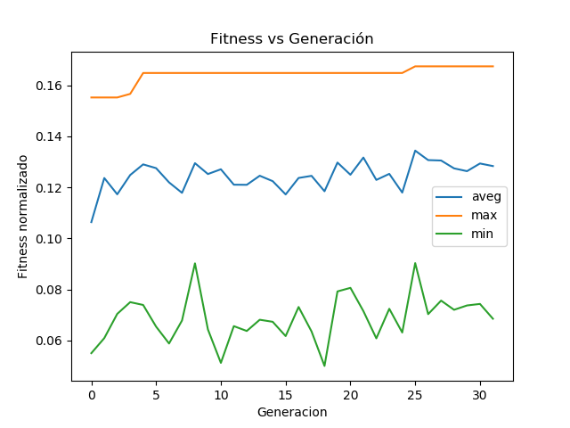

# MOSEntrega2

## Información general

Implementación de un algoritmo evolutivo para para el aprendizaje de una red neuronal que clasifica dígitos escritos en python 2. 

Integrantes:

- Mauricio Neira        201424001
- Camilo Anzola         201529838
- Juan Camilo Pinilla   201533888
- Juan Diego Chaves     201533528    


Los datos utilizados se encuentran en un archivo compriido en la carpeta data. El codigo fuente se encuentra en /src donde están los siguientes archivos:

- dataHandler.py 
    - libreria para visualizar digitos y classificacion correcta de los datos
- graph.py
    - script de python que grafica los resultados obtenidos de main 
- mnist_loader.py
    - libreria para cargar los datos /data/mnist.pkl.gz, obtenida de Michael Nielsen en https://github.com/mnielsen/neural-networks-and-deep-learning.git
- network.py
    - template de red neuronal mas funcionalidades adicionales agregadas por el equipo. Código original de Michael Nielsen en: https://github.com/mnielsen/neural-networks-and-deep-learning.git
- main.py
    - script que corre el algoritmo evolutivo principal

## Breve explicación del codigo

En main.py se ejecuta lo siguiente:

```python
#se cargan los datos 
training_data, validation_data, test_data = mnist_loader.load_data_wrapper()

#se inicializa la poblacion
networks = ga.genPopulation(10)

#se calcula el fitness inicial
ga.calcFitnessAll(networks, test_data)

#se realizan 100 generaciones
for i in range(100):
    iterate(networks)
```

iterate(networks) se encarga de avanzar las generaciones por 1. Por el momento, dadas las restricciones computacionales, se decidió avanzar 100 generaciones. 

Miremos en detalle iterate(networks):

```python

def iterate(networks):

    chosen = []
    # escogemos a los 10 mejores
    for i in range(10):
        chosen.append(i)

    temps = []
    for i in range(len(chosen)/2):

        # se crean hijos segun los mejores individuos de la poblacion
     
        son1, son2 = ga.crossover(networks[random.choice(chosen)], 
                                  networks[random.choice(chosen)])
        #y se mutan
        for i in range(5):
            ga.mutate(son1)
            ga.mutate(son2)

        temps.append(son1)
        temps.append(son2)

    #se eliminan todos los individuos salvo los 10 mejores
    while(len(networks) > 10):
        networks.pop(-1)

    #se agregan los hijos
    for i in temps:
        networks.append(i)

    #se calcula el fitness de todos y se ordena la poblacion
    #por fitness descendientemente
    ga.calcFitnessAll(networks, test_data)

    #imprimimos a consola 
    prints = []
    for net in networks:
        prints.append(net.fitness)
    print(prints)

    #exportamos a un archivo al mejor de esta generacion, 
    #el promedio de la generacion y el peor de la generacion
    prints = np.array(prints)
    with open("metaResults.txt", "a") as myfile:
        myfile.write(str(np.average(prints)) + " " +
                     str(np.max(prints)) + " " + str(np.min(prints)) + "\n")


```
Las funciones crossover y mutate se encargan de mezclar el código genético y mutarlo. Al final se decide exportar los resultados de la poblacion para graficarlos después. 


## Resultados
Para cada generación se graficó:
- El fitness del mejor individuo
- El fitness promedio de la población
- El fitness del peor individuo

Los resultados para las primeras 30 generaciones se encuentran a continuación:



Como se puede ver, el fitness del mejor individuo y del promedio va aumentando paulativamente - tal y como se espera. 

Por ahora, dadas las demoras en la evaluación del fitness (se tiene que iterar sobre muchas imágenes para establecer el fitness de una red), no se pudieron correr muchas generaciones. 

Migrar a un lenguaje de mas bajo nivel o implementar caminatas aleatorias sobre una sola red neuronal podrían sel alternativas para mejorar el tiempo de cómputo. Aún así, aunque sea lento, el modelo se comporta de manera correcta - las redes aprenden a clasificar dígitos. 