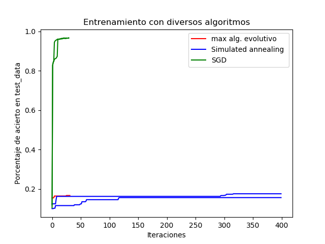

# MOSEntrega2

## Información general

Implementación de un algoritmo evolutivo para para el aprendizaje de una red neuronal que clasifica dígitos escritos en python 2. 

Integrantes:

- Mauricio Neira        201424001
- Camilo Anzola         201529838
- Juan Camilo Pinilla   201533888
- Juan Diego Chaves     201533528    


Los datos utilizados se encuentran en un archivo compriido en la carpeta data. El codigo fuente se encuentra en /src donde están los siguientes archivos:

- dataHandler.py 
    - libreria para visualizar digitos y classificacion correcta de los datos
- graph.py
    - script de python que grafica los resultados obtenidos de main 
- mnist_loader.py
    - libreria para cargar los datos /data/mnist.pkl.gz, obtenida de Michael Nielsen en https://github.com/mnielsen/neural-networks-and-deep-learning.git
- network.py
    - template de red neuronal mas funcionalidades adicionales agregadas por el equipo. Código original de Michael Nielsen en: https://github.com/mnielsen/neural-networks-and-deep-learning.git
- main.py
    - script que corre el algoritmo evolutivo principal
- mainStochastic.py
    - script que corre el algoritmo de Metropolis-Hastings Simulated Annealing. Se puede consultar https://en.wikipedia.org/wiki/Simulated_annealing para mayor información sobre el algoritmo
- mainSGD.py
    - algoritmo que corre stochastic gradient descent. Fue desarrollado con la ayuda del código original de Michael Nielsen en:
    https://github.com/mnielsen/neural-networks-and-deep-learning.git
- dataSGD
    - carpeta con los resultados de mainSGD.py

- dataStochastic
    - carpeta con los resultados de mainStochastic.py
- graphAll.py
    - script de python que grafica los resultados de todos los algoritmos

## Breve explicación del codigo

### Algoritmo Evolutivo

En main.py se ejecuta lo siguiente:

```python
#se cargan los datos 
training_data, validation_data, test_data = mnist_loader.load_data_wrapper()

#se inicializa la poblacion
networks = ga.genPopulation(10)

#se calcula el fitness inicial
ga.calcFitnessAll(networks, test_data)

#se realizan 100 generaciones
for i in range(100):
    iterate(networks)
```

iterate(networks) se encarga de avanzar las generaciones por 1. Por el momento, dadas las restricciones computacionales, se decidió avanzar 100 generaciones. 

Miremos en detalle iterate(networks):

```python

def iterate(networks):

    chosen = []
    # escogemos a los 10 mejores
    for i in range(10):
        chosen.append(i)

    temps = []
    for i in range(len(chosen)/2):

        # se crean hijos segun los mejores individuos de la poblacion
     
        son1, son2 = ga.crossover(networks[random.choice(chosen)], 
                                  networks[random.choice(chosen)])
        #y se mutan
        for i in range(5):
            ga.mutate(son1)
            ga.mutate(son2)

        temps.append(son1)
        temps.append(son2)

    #se eliminan todos los individuos salvo los 10 mejores
    while(len(networks) > 10):
        networks.pop(-1)

    #se agregan los hijos
    for i in temps:
        networks.append(i)

    #se calcula el fitness de todos y se ordena la poblacion
    #por fitness descendientemente
    ga.calcFitnessAll(networks, test_data)

    #imprimimos a consola 
    prints = []
    for net in networks:
        prints.append(net.fitness)
    print(prints)

    #exportamos a un archivo al mejor de esta generacion, 
    #el promedio de la generacion y el peor de la generacion
    prints = np.array(prints)
    with open("metaResults.txt", "a") as myfile:
        myfile.write(str(np.average(prints)) + " " +
                     str(np.max(prints)) + " " + str(np.min(prints)) + "\n")


```
Las funciones crossover y mutate se encargan de mezclar el código genético y mutarlo. Al final se decide exportar los resultados de la poblacion para graficarlos después. 

### Algoritmo de Simulated Annealing 

La idea general del algoritmo es generar una red neuronal con pesos y biases aleatorios. De ahí, se salta de forma aleatoria a otro punto en el espacio y se evalua su optimalidad relativa al punto donde se encontraba previamente. Entre mejor sea este nuevo punto, mayor es la probabilidad de que se mueva allí. La temperatura aquí es un parámetro auxiliar para evitar que el algoritmo se quede atorado en un mínimo local.

El corazón del algoritmo se encuentra a continuación:

 ``` python

# se crea una red neuronal principal,
# una auxiliar para evaluar el nuevo punto
# y una red para guardar la mejor red hasta el momento
net = network.Network(sizes)
net2 = network.Network(sizes)
best = network.Network(sizes)

# se igualan todas las redes al comienzo
net2.cambiarPesos(net)
best.cambiarPesos(net)

arch = open("progreso.dat","a+")

# se inicializa la temperatura 
T = 0.10
while(T>0):
    #se muta la red
    mutar(net.weights, net.biases)
    # se calcula la probabilidad de saltar
    talpha = alpha(net2,net,T)
    # se determina si se salta
    if(talpha>np.random.rand()):
        print("entra")
        # se cambian las redes relevantes si se salta
        net2.cambiarPesos(net)
        if(best.evaluateNormed(test_data)<net.evaluateNormed(test_data)):
            best.cambiarPesos(net2)

    # se registran los cambios
    arch.write(str(T) + " " + str(best.evaluateNormed(test_data)) + "\n")
    
    T= T-0.0001
    print "Net2: " + str(net2.evaluateNormed(test_data))+ " Net: " + str(net.evaluateNormed(test_data)) + " Best: " + str(best.evaluateNormed(test_data)) + " T: " + str(T) + " alpha: " + str(talpha)

arch.close()
```

### Algotirmo SGD

Fundamentalmente, este algoritmo calcula el gradiente de la función de error y se mueve en la dirección de menor crecimiento. Es decir, se mueve en la dirección que minimiza la función de error. El problema principal con este algoritmo es que puede quedarse atorado en mínimos locales. Sin embargo, es considerablemente más rápido que los otros algoritmos. El corazón de el algoritmo es el siguiente:

```python

def procesarLote(net, lote, eta):
    #gradientes de pesos y biases
    gradB = []
    gradW = []
    #los llenamos con ceros
    for i in range(len(net.biases)):
        gradB.append(np.zeros(net.biases[i].shape))
        gradW.append(np.zeros(net.weights[i].shape))
    #se itera sobre cada imagen del lote
    for im, dig in lote:
        dgradB, dgradW = retropropag(net, im, dig)
        gradB = [nb+dnb for nb, dnb in zip(gradB, dgradB)]
        gradW = [nw+dnw for nw, dnw in zip(gradW, dgradW)]
    #se actualizan los pesos y los biases
    net.weights = [w-(eta/len(lote))*dw
                   for w, dw in zip(net.weights, gradW)]
    net.biases = [b-(eta/len(lote))*db
                  for b, db in zip(net.biases, gradB)]


#creamos una red
net = network.Network(sizes)
#escribimos resultados a un archivo
arch = open("./dataSGD/data.dat","a+")
print str(0) + " " + str(net.evaluateNormed(test_data))
arch.write(str(0) + " " + str(net.evaluateNormed(test_data)) + "\n")

#iteramos iteraciones veces sobre los datos de entrenamiento
for i in range(1, iteraciones):
    #reorganizamos los datos para un aprendizaje mas eficiente
    shuffle(training_data)
    lotes = []
    #particionamos la información en lotes
    for j in range(0, len(training_data), tam):
        lotes.append(training_data[j:j+tam])
    #procesamos cada lote 
    for lote in lotes:
        procesarLote(net, lote, 3.0)
    #se evalua la eficiencia de la iteracioin
    print str(i) + " " + str(net.evaluateNormed(test_data))
    arch.write(str(i) + " " + str(net.evaluateNormed(test_data)) + "\n")
arch.close()
```

## Resultados
Para los tres algoritmos se grafico la red neuronal con máximo de aciertos para cada iteracion. Los resultados son los siguientes:



Los resultados obtenidos concuerdan con los esperado. Los 3 algoritmos evidencian una mejora en el aprendizaje pero lo hacen en tasas muy distintas. 

Los mas lentos son el algoritmo evolutivo y el algoritmo de metropolis-hastings (Simulted annealing). 

En el caso del algoritmo evolutivo, esto tiene sentido pues es caro evaluar cada miembro de la población para obtener el fitness. 

Por otro lado, el caso de simmulated annealing tiene que muestrear un espacio muy grande. Dado que es probabilistico y no siempre se mueve en la dirección de menor error, se demora más que SGD. 

En resumen, se logró entrenar la red neuronal con 3 algoritmos distintos. Si bien todos funcionan, los 3 son considerablemente diferentes en eficiencia. Para este caso en particular, SGD es significativamente más eficiente que sus contrapartes. 
